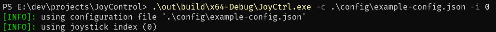

# JoyCtrl
PC control using a joystick.

## Instructions
Project uses CMake as the build system. 
Project libraries are built and linked using vcpkg. 
Connect CMake with your vcpkg toolchain script and build the project.

---
```JoyCtrl``` binary will be built. Required arguments for the binary are ```-c``` for the configuration file and ```-i``` for the controller index.

## Platforms
Application currently runs only on Windows. Linux platform support is in progress.

## Usage
Configurations are defined using the ```.json``` file format. Examples can be found in the ```config``` folder.
For each application, one can define multiple configurations based on the current window title using a regex pattern. For example, if one wishes to define a configuration for Microsoft Edge application while the ```.pdf``` file is opened, one can specify regex ```\w*.pdf```.




### Usage example


Once the app is started, it starts recording window activity and watches for the applications defined in the configuration.
## Examples
-  ```config/example-config.json``` - contains a simple example of the joystick configuration for Microsoft Edge application when a ```.pdf``` file is opened.

## Dependencies
 - [nlohmann/json](https://github.com/nlohmann/json) - configuration file parsing
 - [p-ranav/argparse](https://github.com/p-ranav/argparse) - argument parsing